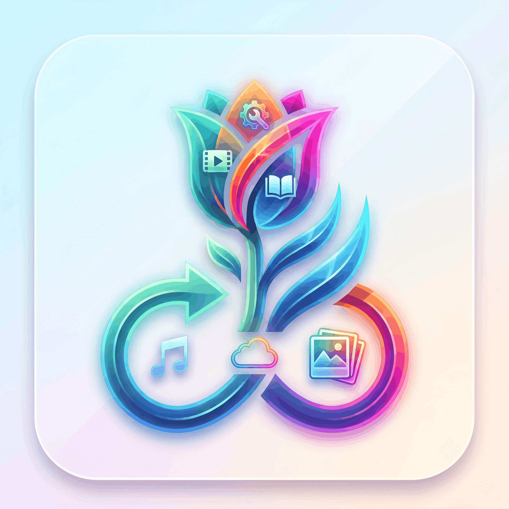

<p align="center">
  
</p>

<h1 align="center">Tulipix</h1>

<p align="center">
Privacy-first, native, all-in-one media manager — <b>Photos · Videos · Music · Podcasts · Audiobooks · Radio · YouTube · Books · Cloud · Tools</b> — built in Rust with a Slint UI.<br/>
No webview, no accounts, no telemetry: everything lives in local SQLite databases on your machine.
</p>

---

## Install

### Grab a release (recommended)

Download the latest build from [**Releases**](https://github.com/atishsharma/tulipix/releases):

| OS | Artifact | Notes |
|---|---|---|
| Linux | `tulipix-<ver>-linux-x86_64.deb` | Debian/Ubuntu — pulls `mpv`, `fuse3` as deps |
| Linux | `tulipix-<ver>-linux-x86_64.rpm` | Fedora/openSUSE |
| Linux | `tulipix-<ver>-linux-x86_64.AppImage` | self-contained, libmpv bundled |
| Linux | `tulipix-<ver>-linux-x86_64.tar.gz` | portable — needs `mpv` from your package manager (Arch: `pacman -S mpv`) |
| Windows | `tulipix-<ver>-windows-x86_64-setup.exe` | Inno Setup installer — everything bundled |
| Windows | `tulipix-<ver>-windows-x86_64.zip` | portable zip — everything bundled |
| macOS | `tulipix-<ver>-macos-aarch64.dmg` | Apple Silicon |

Bundled per-platform: ffmpeg, yt-dlp, whisper.cpp, rclone, exiftool (and mpv on Windows/macOS/AppImage). On Linux deb/rpm/tar.gz, `mpv` comes from your package manager so it stays current.

### Build from source

```bash
rustup default stable          # stable toolchain builds everything
cargo install just             # task runner (all workflows go through the justfile)
# optional, for installers:
cargo install cargo-deb cargo-wix cargo-bundle cargo-generate-rpm
```

- **ffmpeg** must be on your system `PATH` (thumbnails, waveforms, conversions).
- **libmpv** powers all playback. On Linux install it from your package manager; on Windows/macOS point the build at your libmpv directory with `TULIPIX_MPV_LIB_DIR=/path/to/libmpv`.

```bash
just fetch        # download bundled binaries (whisper.cpp, yt-dlp, rclone, exiftool)
just run          # build + run (memory-capped systemd scope)
just run-dev      # build + run with HOT SLINT RELOAD — edit ui/*.slint, see it live
just lint         # clippy -D warnings + fmt --check
just contrast     # WCAG AAA contrast audit on the theme tokens
```

<details>
<summary>Fast Linux dev path (nightly + Cranelift + sccache)</summary>

The justfile injects nightly + Cranelift + sccache at the CLI for much faster debug builds, without touching the committed config (stable / Windows / macOS builds stay unaffected):

```bash
rustup toolchain install nightly
rustup component add rustc-codegen-cranelift-preview --toolchain nightly
cargo install sccache
```

`just run-dev` builds into a separate `target-dev/` directory with `SLINT_LIVE_PREVIEW=1`, so the UI is interpreter-backed and re-reads `.slint` files at runtime. Rust changes still need a rebuild; pure UI changes appear instantly.

Both run recipes wrap cargo in a `systemd-run` scope (`MemoryHigh=5800M / MemoryMax=6400M`, `nice`/`ionice`) so a cold build of the large app crate cannot freeze a small machine.
</details>

<details>
<summary>Release + installer recipes</summary>

```bash
just release-linux   # x86_64-unknown-linux-gnu --release
just release-win     # x86_64-pc-windows-msvc   --release
just release-mac     # aarch64-apple-darwin     --release

just installer-linux # .deb via cargo-deb
just installer-win   # .msi via cargo-wix
just installer-mac   # .app via cargo-bundle
```

The binary is `tulipix` (package `tulipix-app`). Tag-push (`v*`) triggers the full CI release matrix for all three OSes.
</details>

---

## Features

### 🎵 Music — My Music

- Library scanner with full tag support (symphonia); albums, artists, genres, folders.
- **Home dashboard**: recently played, top artists, top albums — paginated, connected gradient-outline styling.
- **Songs** view: sortable (title / release / artist / star rating, each ascending or descending), grid-density slider, pagination.
- **Playlists**: manual playlists with custom ordering (reorder arrows), smart playlists (Loved, Recently Added — duplicate-proof, audiobooks excluded), M3U/PLS import + export, custom cover art, right-click context menu with Open / Delete (confirmation dialog), per-playlist sort.
- **Loved + History** tabs, star ratings, play counts.
- Lyrics: synced LRC via LRCLIB with a whole-library sync manager; 3-line inline display in the players; **karaoke button** on the player bar.
- **Sonic Similar** on the player bar — acoustic-similarity recommendations from the current track.
- Metadata manager: fetch tags from MusicBrainz with live progress.
- 10-band equalizer with savable custom profiles, instant-mix / auto-DJ, queue management.
- **Persistent mpv transport** — one long-lived player process across tracks (gapless-feeling, instant starts) + Cast v2.
- Optional scrobbling to Last.fm and ListenBrainz (off by default).

### 🎙 Music — Podcasts

- RSS subscriptions: paste any feed URL; refresh-all with a live progress pill.
- **Home**: pinned "Your shows" (14 per page, sortable by name/category/latest) + a latest-episodes feed.
- **Trends**: curated directory with one-click subscribe.
- **Single-show page**: hero layout (cover · wide info card · big round Back button), 200-char summary with the full text in the ⓘ Info popup, episode sort + pagination, pin to Home.
- **Offline downloads**: sequential queue — one episode at a time; full-width progress bar under the header (episode title, percent, "+N in queue" badge); queued rows marked "Queued"; Downloads tab sorted by download time (▲/▼) with a per-row "when downloaded" stamp; single and clear-all removal, both confirmed.
- Episode transcript / show-notes panel; played tracking; playback speed 0.75–2×, pitch-corrected.
- Podcast-tuned mini player: −15s / play / +30s / speed transport row, episodes + show-notes faces.

### 📚 Music — Audiobooks

- Folder-based books: each audiobook folder is one book with cover, chapters and total duration.
- **Detail page**: cover · info/control card (speed chips up to 3×, chapter step, skip-silence, bookmarks) · big Back with a large Resume button beneath.
- Resume exactly where you left off (per book); In-progress / Finished tabs; custom covers.
- Plays through the mini player in book mode — the second line always shows the book title.

### 📻 Music — Internet Radio

- 15 curated India-first categories (Bollywood, Hindi, Punjabi, Tamil, Telugu, Malayalam, Kannada, Marathi, Bengali, Urdu·Ghazal, Classical, Retro 90s, Lofi, Global Hits, Top India) backed by radio-browser.info.
- **Offline-first cache**: "Refresh stations" (confirmed) snapshots every category; pages open instantly without network; home tiles show per-category counts and the header counts every cached station.
- **Universal search** across every cached category + saved stations, with network fallback.
- Station lists: 20 per page with header pagination; sort by Top / Name / Bitrate, each with ▲/▼ direction; favicon thumbs, quality pills, favourites hearts.
- Favourites + Recent (last 50, clear with confirmation); add custom stations by direct stream URL (AIR/Akashvani mounts etc).
- Live playback via mpv with ICY now-playing titles and a ~10s network-dip cushion; stream recording through the Tools queue.
- Radio-tuned mini player: big spinning record (no tonearm), one aligned control row (play · volume · zen), gradient "Internet Radio - Live" badge.

### ▶️ Music — YouTube

- 5 tabs (Home · Subscriptions · Trends · Downloads · Search) backed by Piped + yt-dlp, in its own `youtube.db`.
- Glass cards, daily recommendation cache, channel pages with avatars.
- Audio streams through the same now-playing transport; **Watch video** hands off to mpv; downloads land in the Tools queue.
- Configurable Piped instance (`api.piped-instance` setting).

### ▶ Player stack (all music modes)

- App-wide draggable, resizable mini player (vinyl art, queue + lyrics faces), dockable to a side bubble; the header pip always restores it.
- **Zen full-screen player**: ambient art wash, 5 visualizer styles (selector beside the lyrics toggle), inline synced lyrics, queue panel, full keyboard shortcuts, light/dark/OLED themes.
- Bottom glass player: seek + volume on one row, art-derived accent wash, inline synced-lyric ticker, transport + heart + queue/lyrics/EQ/sleep extras.
- The playing section's header tab wears an animated gradient ring while audio runs.
- Mode-aware second line: artist · album (music), show name (podcasts), book title (audiobooks), live badge (radio).
- Cast/UPnP control-URL discovery, sleep timer, volume to 130%, shuffle/repeat.

### 🖼 Photos

- Folder scanner with EXIF extraction, PNG thumbnail pipeline, timeline + album views.
- Built-in photo editor: adjust, curves, crop/rotate/flip, filters, tint, text, red-eye, enhance, sharpen, resize — plus AI ops (heal, sky, upscale, colorize).
- Manual albums, slideshow with hero transitions, ambient screensaver.
- **On-device AI** (ONNX, downloaded on demand in Settings → AI, SHA-256 pinned): CLIP search, face detection (SCRFD), object detection (YOLO), inpainting (LaMa), SAM, Real-ESRGAN upscale, DeOldify colorize. Nothing leaves your machine.

### 🎬 Videos

- Library scanner with TMDB/TVDB metadata, posters and subtitles support; embedded libmpv playback with GPU surface bridge; PiP floating player.

### 📖 Books

- EPUB + CBZ/comics parser, ComicVine metadata, built-in reader with typography controls + TTS, collections (Reading / Unread / Comics / Series / Authors).

### ☁️ Cloud

- rclone-driven remote manager: remote CRUD, tree browser, sync jobs, encrypted vault, versions/snapshots, ransomware guard, share links, selective sync, streaming preview — credentials stay local, no accounts.

### 🛠 Tools

- Real background job queue with live progress: video/audio/photo compress + convert, trim, resize, merge/split, watermark, hash, folder diff, batch rename, yt-dlp downloads (video/playlist/live), whisper.cpp transcription, stream recording.

### 👤 Profile & personalization

- Facebook-style profile page: full-width cover photo + overlapping avatar.
- **Upload your own cover and avatar** with a built-in pan-and-zoom cropper; stored locally, restored on every start.
- Emoji avatars, display name, theme picker (system/light/dark/extra-dark), reduce-motion toggle.
- **Choose the sidebar logo** from four bundled Tulipix marks — one Save button persists everything.
- Credits grid crediting every major open-source project the app is built with.

### 🧩 Platform

- Command palette, onboarding wizard (with optional AI-model download step), scan-progress HUD, per-OS tray/menus/notifications, WASM + Lua plugin sandbox, headless CLI companion.
- Light / dark / OLED themes app-wide, WCAG-audited tokens; Tabler icon set.
- App lock with passkey unlock and database encryption.

---

## Workspace layout

```
crates/
  tulipix-app/        Slint UI + main event loop (binary: tulipix)
  tulipix-core/       db pool, settings, keyring, fs, ipc, prefs, caps
  tulipix-common/     playback core + shared singletons
  tulipix-photos/     photos.db + scanner + EXIF + editor + AI hooks
  tulipix-videos/     videos.db + scanner + TMDB/TVDB + subs
  tulipix-music/      music.db / podcasts.db / radio.db / youtube.db + scanners + tags
  tulipix-books/      books.db + epub/cbz parser + comicvine
  tulipix-cloud/      cloud.db + rclone driver
  tulipix-player/     libmpv wrapper + GPU surface bridge
  tulipix-ai/         LLM chat, captions, onboarding model catalogue
  tulipix-whisper/    whisper.cpp subprocess + FIFO queue
  tulipix-tools/      background job queue (recording, conversion)
  tulipix-platform/   per-OS code (menus, tray, notifications, vibrancy)
  tulipix-plugins/    WASM (wasmtime) + Lua (mlua) sandboxed extension host
  tulipix-sec-*/      extracted section crates (music, photos, videos, tools, cloud)
  tulipix-cli/        headless companion CLI
tools/
  fetch-resources/    binary fetcher with SHA-256 verification
ui/                   Slint .slint files, tokens, glass/orb assets
resources/            bundled binary manifest, ONNX model manifest, icons + app logos
```

---

<p align="center">
Tulipix © 2026 — Developed by <b>Atish Ak Sharma</b><br/>
<sub>Built with Rust, Slint, Tokio, SQLite, mpv, FFmpeg, yt-dlp, rclone, whisper.cpp, ONNX Runtime, image-rs, Lucide/Tabler, ExifTool, Serde, reqwest, muda.</sub>
</p>
